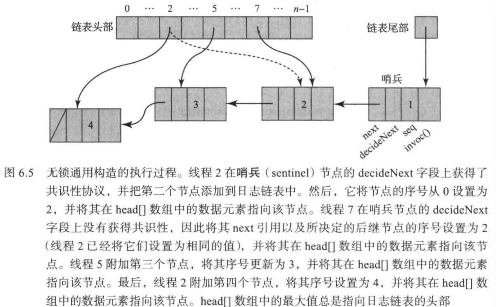
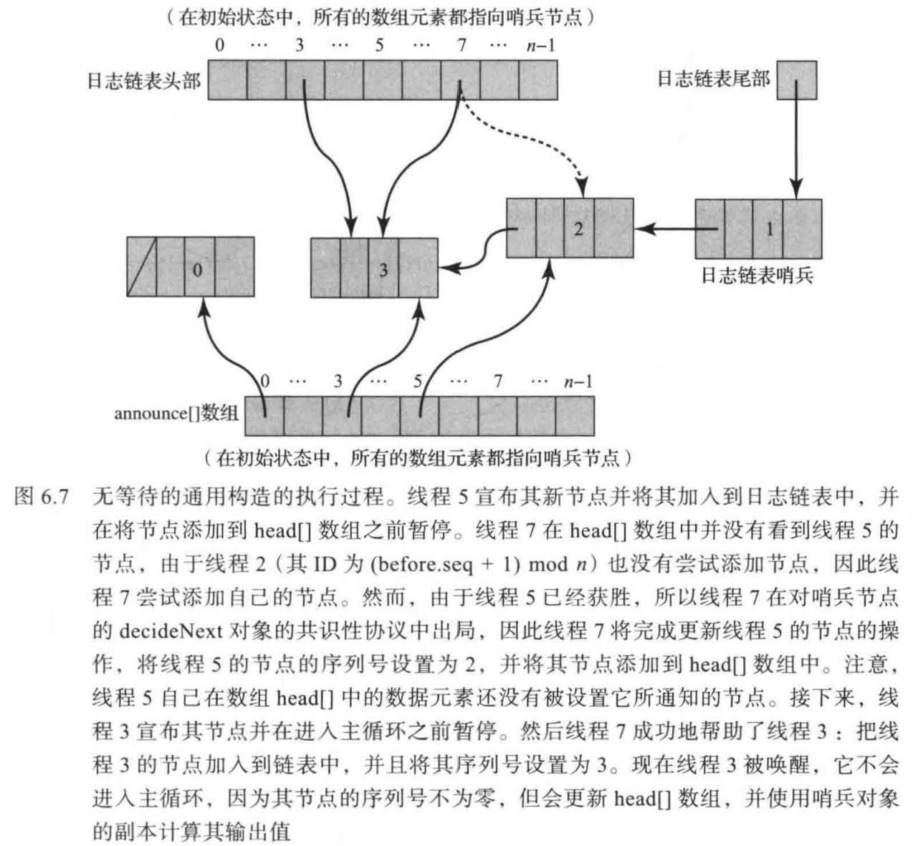

<h1 align="center">多处理器编程的艺术</h1>
<h2 align="center">第六章 共识性的通用性</h2>

## 1. 引言

在第 5 章中，我们介绍了一种简便的证明方法，用于判定形如“不存在通过 Y 来构造 X 的无等待的实现”的命题。接下来，针对具有确定性串行规范的对象类，我们构建了一个层次结构（见图 6.1），其中低层对象无法用于实现高层对象。每个对象都有一个关联的**共识数**，表示该对象可以解决共识问题的最大线程数。在包含不少于 n 个并发线程的系统中，无法利用共识数小于 n 的对象，构造出共识数为 n 的对象的无等待（或无锁）实现。此后，除非特别说明，所有适用于无等待实现的结论，同样适用于无锁实现。

第5章的不可能性结论，并不意味着无等待同步本身不可行或无法实现。事实上，本章将证明存在一些**通用**（universal）对象：只要提供足够数量的这类对象，就能为任意并发对象构造出一种无等待且可线性化的实现。

在一个包含 n 个线程的系统中，当且仅当一个类的共识数大于或者等于 n 时，这个类是通用的。在图 6.1 中，第 n 层的类对于一个包含 n 个线程的系统是通用的。当且仅当一种机器的体系结构或者程序设计语言能够以通用类的对象作为操作原语时，该机器的体系结构或者程序设计语言才具有支持任意无等待同步的计算能力。例如，现代多处理器提供的 `compareAndSet` 指令对于任意数量的线程都是通用的。因此，搭载该指令的机器能够以无等待的方式实现任何并发对象。

| 共识数 | 对象                                                |
| ------ | --------------------------------------------------- |
| 1      | 原子寄存器                                          |
| 2      | getAndSet、getAndAdd、Queue、Stack                  |
| …      | …                                                   |
| m      | (m, m(m+1)/2)—赋值对象                              |
| …      | …                                                   |
| ∞      | 存储器—存储器迁移、compareAndSet、链式加载/条件存储 |

<p align="center">图 6.1 并发可计算性和同步操作的通用层次结构</p>

本章主要阐述如何使用共识性对象来实现并发对象的**通用构造** (universal construction) 。本章并没有涉及实现无等待对象的实用技术。与经典的可计算性理论一样，理解通用结构及其本质含义可以避免犯试图去解决那些无法解决的问题的幼稚错误。一旦理解了为什么共识性足够强大并且能够用以实现任何类型的对象，我们就可以通过工程实践使这种构造更加有效。

## 2. 通用性

如果可以使用类 C 的若干对象以及若干读写寄存器，构造出任意对象的无等待实现，则称类 C 是通用的。构造中允许使用多个类 C 的对象，是因为我们关注的是机器指令的同步能力，而大多数机器指令也确实可以作用于多个存储单元。允许使用多个读写寄存器，是因为它们仅用于簿记，且现代体系结构通常提供大量存储器。为了避免无关细节的干扰，我们对所使用的共识对象数量和读写寄存器数量均不作限制；存储单元的回收问题则留给读者自行考虑。本章先从无锁实现入手，再将其扩展为稍复杂的无等待实现。

## 3. 无锁的通用构造

图 6.2 描述了串行对象的一个**通用**（generic）定义，该定义基于第 3 章的调用 - 响应表达公式。每个对象都以一种固定的初始状态被创建。apply() 方法以一个调用（invocation） 作为其参数，该参数描述调用的方法及其参数，并返回一个响应，该响应包含调用的终止条件（正常或者异常）以及返回值（如果有返回值的话）。 例如，一个栈的调用可能包含方法 push() 及一个参数，而对应的响应将是一个正常状态和无返回值。

```java
public interface SeqObject {
    public abstract Response apply(Invoc invoc);
}
```

<p align="center">图 6.2 一个通用的串行对象：apply() 方法执行调用并返回一个响应</p>

图 6.3 和图 6.4 描述了一种通用构造，该通用构造可以将任何串行对象转换为无锁并且可线性化的并发对象。这种构造假定串行对象都是**确定的**（deterministic）：如果对处于特定状态的某个对象调用一个方法，那么只有一个可能的响应和一个可能的新对象状态。可以将任何一个对象表示为处于初始状态的一个串行对象和一个日志的组合，其中日志是由节点组成的链表，表示应用于该对象的方法调用序列（即对象的状态转换序列）。线程通过将新调用添加到链表头部来执行方法调用。然后，线程从尾部到头部遍历链表，并将方法调用应用于对象的私有副本。线程最终返回执行操作的结果。关键之处在于，一定要理解只有日志的头部是可变的：初始状态和日志头部前面的所有节点永远不会改变。

```java
public class Node {
    public Invoc invoc;					// 方法名称及参数
    public Consensus<Node> decideNext;	// 决定链表中的下一个节点
    public Node next;					// 下一个节点
    public int seq;						// 序列号
    public Node(Invoc invoc) {
        invoc = invoc;
        decideNext = new Consensus<Node>();
        seq = 0;
    }
    public static Node max(Node[] array) {
        Node max = array[0];
        for (int i = 1; i < array.length; i++) {
            if (max.seq < array[i].seq)
                max = array[i];
        }
        return max;
    }
}
```

<p align="center">图 6.3 Node 类</p>

```java
public class LFUniversal {
    private Node[] head;
    private Node tail;
    public LFUniversal() {
        tail = new Node();
        tail.seq = 1;
        for (int i = 0; i < n; i++)
            head[i] = tail;
    }
    public Response apply(Invoc invoc) {
        int i = ThreadID.get();
        Node prefer = new Node(invoc);
        while (prefer.seq == 0) {
            Node before = Node.max(head);
            Node after = before.decideNext.decide(prefer);
            before.next = after;
            after.seq = before.seq + 1;
            head[i] = after;
        }
        SeqObject myObject = new SeqObject();
        Node currenct = tail.next;
        while (currenct != prefer) {
            MyObject.apply(currenct.invoc);
            currenct = currenct.next;
        }
        return myObject.apply(currenct.invoc);
    }
}
```

<p align="center">图 6.4 无锁的通用构造</p>

如何使这种基于日志的构造支持并发（也就是说，允许线程对 apply() 方法进行并发调用）呢？试图调用 apply() 方法的某个线程会创建一个节点来保存其调用。然后，这些并发线程通过竞争以将它们各自的节点加入到日志链表的头部，它们通过运行一个 n-线程共识性协议，以决定将哪个节点添加到日志链表中。这个共识性协议的输入是对这些线程节点的引用，而输出结果是唯一的获胜节点。

然后，获胜线程可以继续计算其 Response。获胜线程将创建一个并行对象的本地副本，并跟随 next 引用从日志链表的尾部到头部反向遍历日志，将日志中的操作应用到它的副本，最后返回与它自己的调用相关联的 Response。即使 apply() 方法的调用是并发的，这个算法也能够正常工作，因为日志链表中该线程自己的节点之前的所有节点永远不会改变。那些没有被共识性对象选中的出局者线程，则必须再次尝试将位于日志头部（在尝试期间会发生变化）的当前节点设置为指向它们。

接下来详细分析这种构造。无锁通用结构的代码如图 6.4 所示。图 6.5 是这个构造的一个执行实例。对象的状态由节点所构成的链表来定义，每个节点都包含一个调用。节点的代码如图 6.3 所示。节点的 decideNext 字段是一个共识性对象，用于决定下一个要被添加到链表中的节点。next 字段用于存储共识性协议的结果（即对下一个节点的引用）。seq 字段是节点在链表中的序号。当节点还没有被线程加入到链表中时，此字段的值为 0，否则为一个正数值。链表中后继节点的序号每次递增 1。初始状态时，日志链表中只包含唯一一个序号为 1 的哨兵节点。

在设计并发无锁的通用构造过程中，其难点在于共识性对象只能被使用一次。

> *创建一个可重用的共识性对象，或者即使是一个仅决定值可读的对象，并不是一项简单的任务。其实质与我们将要设计的通用构造基本上是同一个问题。例如，考虑 5.4 节中基于队列的共识性协议。在共识性对象状态被决定之后，如何使用一个 Queue 队列来允许重复读取共识性对象的状态并不是一件很容易的事情。*



在图 6.4 中的无锁算法中，每个线程分配一个节点来保存它的调用，并反复尝试将该节 点附加到日志链表的头部。每个节点都有一个 decideNext 字段，该字段是一个共识性对象, 每个线程通过将其节点作为链表头部节点的 decideNext 字段上一个共识性协议的输入，以 尝试将该节点添加到日志链表中。由于不参与此共识性的线程需要遍历链表，所以将这个共 识性的结果存储在节点的 next 字段中。多个线程可以同时更新这个字段，但它们都必须写 入相同的值。当一个线程把一个节点附加到日志链表时，该线程会设置这个节点的序号。

一旦某个线程的节点成为日志链表的一部分，该线程就会从日志链表尾部到新添加节点 进行反向遍历，从而计算与其调用相对应的响应。它将每个调用应用于对象的私有副本，并 返回它自己调用的响应。请注意，当一个线程计算其响应时，必须已经将其所有前置线程的 next 引用设置完成，因为这些节点已经添加到链表的头部。任何将节点添加到链表中的线程 都必定已经使用 decideNext 共识性协议的结果更新了它之前的 next 引用。

如何确定该日志链表的头部呢？由于日志链表头部必须不断更新，而且每个线程只能访 问共识性对象一次，因此不能使用一个共识性对象来跟踪日志链表的头部。相反，我们创建 了一种在面包房（bakery）锁算法中使用的针对每一个线程的结构（2.7 节）。采用一个 n 元数组 head[]，其中 head[i] 是线程 i 观察到的链表中的最后一个节点。在初始状态中，数组 head[] 中的所有数据元素都指向尾部哨兵节点 tail。链表的头部是 head[] 数组中所指向的节点中具有最大序号的节点。图 6.3 中的 max() 方法执行一次收集操作，读取 head[] 数组中的 所有数据元素并返回具有最大序号的节点。

该构造是串行对象的一种可线性化实现。每个 apply() 方法的调用都可以利用 decide() 方法的调用将节点添加到日志链表中的时间点线性化。

为什么这个构造是无锁的？因为日志链表的头部（就是最新添加的节点）可以在有限的步数内添加到 head[] 数组中。节点的前置节点必须出现在 head[] 数组中，因此任何重复尝试添加新节点的节点都将在 head[] 数组上重复运行 max() 函数。该构造检测到前一个节点， 对其 decideNext 字段应用共识性协议，然后更新获胜节点的字段及其序号。最后，它将决 定后的节点存储在该线程 head[] 数组的数据元素中。新的头部节点最终总是会出现在 head[] 中的。某个线程总是未能成功将自己的节点添加到日志链表中的唯一可能就是其他线程不断 成功地将自己的节点添加到日志链表中。因此，只有当其他节点不断地完成它们的调用时, 一个节点才会被饿死. 这就说明该构造是无锁的。

## 4. 无等待的通用构造

如何使一个无锁的算法变成无等待的算法呢？图 6.6 描述了一种无等待的完整算法。我 们必须保证每个线程在有限的步数内完成 apply() 方法的调用，换而言之，所有的线程都不会被饿死。为了保证这一特性，正在演进的线程可以帮助没有机会演进的线程完成它们的调用。这种互帮互助的模式稍后将以一种特殊的形式出现在其他无等待算法中。

为了启用这种互帮互助的模式，每个线程都必须与其他线程共享其试图完成的 apply() 方法调用。为此，我们增加一个 n 元数组 announce[]，其中 announce[i] 是线程 i 当前正在尝试加入到链表中的节点。在初始状态中，所有的数组元素都指向哨兵节点（其序号为 1 ）。 当线程 i 将一个节点存储在 announce[i] 中时，它会宣告这个节点。

```java
public Universal {
    private Node[] announce;	// 拥有协调帮助的数组
    private Node[] head;
    private Node tail = new Node();
    public Universal() {
        tail.seq = 1;
        for (int j = 0; j < n; j++) {
            head[j] = tail;
            announce[j] = tail;
        }
    }
    public Response apply(Invoc invoc) {
        int i = ThreadID.get();
        announce[i] = new Node(invoc);
        head[i] = Node.max(head);
        while (announce[i].seq == 0) {
            Node before = head[i];
            Node help = announce[(before.seq + 1) % n];
            if (help.seq == 0)
                prefer = help;
            else
                prefer = announce[i];
            Node after = before.decideNext.decide(prefer);
            before.next = after;
            after.seq = before.seq + 1;
            head[i] = after;
        }
        head[i] = announce[i];
        SeqObject myObject = new SeqObject();
        Node current = tail.next;
        whlie (current != announce[i]) {
            myObject.apply(current.invoc);
            current = current.next;
        }
        return myObject.aplly(current.invoc);
    }
}
```

<p align="center">图 6.6 无等待的通用构造</p>

为了执行 apply() 方法，线程首先宣告它的新节点。这个步骤可以确保如果线程本身无法成功地将它的节点附加到日志链表中，则其他的某个线程可以代表该线程将其节点加入到日志链表中。然后像以前一样继续执行，并尝试着将该节点加入到日志链表中。为此，该方法只读取一次 head[] 数组（第 15 行代码）， 然后进入算法的主循环，然后一直循环直到它自己的节点被加入到日志链表中（在第 16 行代码中，当序号变为非零时被检测到）。下面是 对无锁算法的一种改进。线程首先检查 announce[] 数组中是否有需要帮助的节点（第 18 行代码）。由于节点会不断添加到日志链表中，因此必须动态确定需要帮助的节点。线程尝试以递增的次序去帮助 announce[] 数组中的节点，该次序由序号除以 announce[] 数组的长度 n 后所得到的余数所决定。我们可以证明这种方法能够保证任何一个靠自己的力量最终无法演进的节点，一旦其拥有者线程的索引与最大序号模 n 的结果值相匹配，最终都会得到其他节点的帮助。如果省略了这个帮助步骤，那么一个单独的线程就有可能被超越任意次。如果被选中进行帮助的节点不需要帮助（例如第 19 行代码中的序号不为零）， 那么每个线程都会尝试把自己的节点加入到日志链表中（第 22 行代码）。announce[] 数组中的所有元素都被初始化为序号为 1 的哨兵节点。算法的其余部分与无锁算法几乎相同。当节点的序号变为非零时，该节点会被加入到日志链表中。在这种情形下，线程会像以前一样继续执行，并根据从链表尾部到自己节点的固定日志段来计算其结果。

图 6.7 显示了无等待通用构造的一个执行过程。从初始状态开始，线程 5 宣告它的新节点并将该节点加入到日志链表中，并在将该节点添加到 head[] 数组之前暂停。然后线程 7 开始执行。由于值 (before.seq + 1) mod n 的结果是 2，但线程 2 并没有尝试添加一个节点，因此线程 7 尝试添加自己的节点。由于线程 5 已经获胜，所以线程 7 在对哨兵节点的 decideNext 对象的共识性协议中出局，因此算法将完成线程 5 的操作，将线程 5 节点的序号设置为 2，并将线程 5 的节点添加到 head[] 数组中。接下来，线程 3 宣告它的节点并在进入 主循环之前暂停。然后线程 7 帮助线程 3：把线程 3 的节点加入到链表中，但是在将其序号 设置为 3 之后，在将节点添加到 head[] 数组之前暂停。现在线程 3 被唤醒，它不会进人主循环，因为其节点的序号不为零，但会更新第 28 行代码处 head[] 数组的内容，并使用哨兵对象的副本计算其输出值。



对无锁算法的这些修改有一个精妙之处。由于不止一个线程可以尝试将特定的节点附加到日志链表中，因此必须确保没有节点被附加两次。一个线程可能正在附加一个节点并设置其序号，而与此同时，另一个线程也在附加同一节点并设置其序号。由于规定了线程读取最大 head[] 数组值的次序以及 announce[] 数组中节点的序号，因此该算法避免了这种错误。设 a 是由线程 A 所创建并由线程 A 和线程 B 附加到日志链表中的节点。在第二次被附加之前，该节点必须至少向 head[] 数组中添加一次。但是，注意由线程 B 从 head[A] 读取的 before 节点（第 17 行代码）必须是 a 本身，或者是日志链表中 a 的后继节点。此外，在将任何节点添加到 head[] 数组之前（第 26 行代码或者第 28 行代码）， 其序号将变为非零（第 25 行代码）。操作的次序确保了线程 B 在第 15 行或者第 26 行代码中设置它的 head[B] 数据元素（基于该数据元素设置 B 的 before 变量，从而导致一个错误的追加）， 然后才验证第 16 行 或者第 19 行代码中 a 的序号是否为非零（取决于线程 A 或者另一个线程是否执行该操作）。 由此可见，对错误的第二次追加的验证将失败，因为节点 a 的序号已经是非零的，并且不会 再次将其添加到日志链表中。

由于没有节点会被两次添加到日志链表中，并且节点被添加到日志链表的次序与相应方法调用的自然偏序明显一致，因此保证了线性一致性。

为了证明该算法是无等待的，需要证明这种互帮互助机制能够保证任何被宣告的节点最终都能被添加到 head[] 数组中（意味着该节点在日志链表中），并且发出宣告的线程可以完成对其结果的计算。为了便于证明，首先定义一些符号。令 max( head[]) 是 head[] 数组中序 号最大的节点，c $\in$ head[] 表示对于某个 i，head[i] 被设置为节点 c。

**辅助**（auxiliary）变量（有时称为幻影 ghost 变量）是在代码中不会显式出现的变量，它不会以任何方式改变程序的行为，但可以帮助我们对算法的行为进行推理。我们使用以下辅助变量：

* concur(A) 是自线程 A 上一次宣告后，被存储在 head[] 数组中的一组节点。
* start(Z) 是线程 A 上一次宣告时，max(head[]) 的序号。

```java
public Response apply(Invoc invoc) {
    int i = ThreadID.get();
    < announce[i] = new Node(invoc); start(i) = max(head); concur(i) = {}; >
    head[i] = Node.max(head);
    while (announce[i].seq == 0) {
        Node before = head[i];
        Node help = announce[(before.seq + 1) % n];
        if (help.seq == 0)
            prefer = help;
        else
            prefer = announce[i];
        Node after = before.decideNext.decide(prefer);
        before.next = after;
        after.seq = before.seq + 1;
        < head[i] = after; (V j) (concur(j) = concur(j) U {after}); >
        SeqObject MyObject = new SeqObject();
        Node current = tail.next;
        while (current != announce[i]) {
            MyObject.apply(current.invoc);
            current = current.next;
        }
        return MyObject.apply(current.invoc);
    }
}
```

<p align="center">图 6.8 带有辅助变量的无等待的通用构造的 applyo 方法。尖括号中的操作假定是原子操作

图 6.8 给出了反映辅助变量以及它们是如何被更新的程序代码。例如，对于语句：
$$
(\forall j) (concur(j) = concur(j) \cup {after});
$$
表示对于所有的线程人 把节点 after 添加到 concur(j) 中。尖括号内的代码语句被认为是以原子方式执行的。由于辅助变量不会以任何方式影响计算，所以可以假设这种原子性。 为了简洁起见，我们稍微扩展一下这个表示法，让应用于节点或者节点数组的函数 max() 返回其序号中的最大值。

注意，在通用构造的整个执行过程中，以下性质是不变的：
$$
|concur(A)| + start(A) = max(head[])
$$
**引理 6.4.1**  对于所有的线程 4，下述断言总是成立的：
$$
|concur(A)| > n => announce[A] \in head[]
$$
**证明**  令 a = announce[A]。 如果 |concur(A)| > n，那么 concur(A) 包括连续的节点 b 和 c（(由线程 B 和线程 C 附加到日志链表中)），它们各自的序号加上 1 后分别等于 (A-1) 模 n 和 A 模 n (注意，线程 B 和线程 C 是将节点 b 和 c 添加到日志链表中的线程，但并不一定是宣告节点 b 和 c 的线程)。线程 C 在执行第 18〜22 行代码时，将位于 announce[A] 中的节点附加到日志链表中，除非它已经被添加到日志链表中。现在需要证明，当线程 C 读取 announce[A] 时，线程为已经宣告了节点 a，因此线程 C 将节点 a 添加到日志链表中，或者节点 a 已经被添加日志链表中。随后，当节点 c 被添加到 head[] 数组中，并且当 |concur(A)| > n 时，根据引理的要求，节点 a 将出现在 head[] 数组中。

为了理解为什么当线程 C 运行到第 18〜22 行代码时节点 a 必须已经被宣告，需要注意 以下几点：

(1) 因为线程 C 已经将其节点 c 附加到 b 之后，所以在第 17 行代码上必定将 b 读取为 before 节点，这意味着在第 17 行代码上的线程 C 从 head[] 数组中读取 b 之前，线程 B 已经将 b 添加到日志链表中。

(2) 由于 b 位于 concur(a) 中，所以线程 A 在 b 被添加到 head[] 数组之前就已经宣告了 a。

从 (1) 和 (2) 中可以看出，在线程 C 执行第 18〜22 行 代码之前线程 A 就已经发出了宣告，所以命题成立。证毕。

引理 6.4.1 对方法调用过程中可以附加的节点数进行了限制。下面给出一系列引理，表明当线程 A 完成对 head[] 数组的扫描时，要么 announce[A] 被附加，要么 head[A] 位于列表末尾的 n + 1 个节点内。

**引理 6.4.2**  以下的性质总是成立的：
$$
max(head[]) \ge start(A)
$$
**证明**  对于每一个 head[i]，其序号是非递减的。证毕。 

**引理 6.4.3**  以下是图 6.3 第 13 行代码的一个循环不变量 (即它在循环的每次迭代期间保持不 变)：
$$
max(max, head[i], ... , head[n-1]) \ge start(A)
$$
其中 i 是循环索引，max 是到目前为止找到的最大序号的节点，A 是执行循环的线程。

换句 话说，最大序号 max 和从当前值 i 到循环末尾的所有 head[] 数据元素永远不会小于线程力发出宣告时数组中的最大值。

**证明**  当 i 为 1 时，根据引理 6.4.2，断言成立 (因为 max = head[0])。在每次迭代中， 当 max 被替换为序号为的 max(max, head[i]) 节点时，命题依然成立。证毕。

**引理 6.4.4**  以下断言在第 16 行代码 (图 6.8 ) 之前成立：
$$
head[A].seq \ge start(A)
$$
**证明**  在第 15 行代码调用 Node.max() 方法之后，结果可以由引理 6.4.3 推断出。否则， head[A] 被设置为指向线程 A 在第 26 行代码处的最后一个附加节点，这会将 head[A].seq 增加 1。证毕。

**引理 6.4.5**  以下特性总是成立：
$$
|concur(A)| \ge head[A].seq - start(A) \ge 0
$$
**证明**  下界可以由引理 6.4.4 推断出，上界可以由等式 (6.4.1) 推断出。证毕。

**定理 6.4.6**  图 6.6 中的算法是正确的并且是无等待的。

**证明**  为了证明该算法是否是无等待的，需要注意线程 A 执行主循环不超过 n + 1 次。 在每次成功的迭代中，head[A].seq 增加 1。在 n + 1 次迭代之后，由引理 6.4.5 可得：
$$
|concur(A)| \ge head[A].seq - start(A) \ge n
$$
根据引理 6.4.1，announce[A] 必定已经被添加到 head[] 中。证毕。